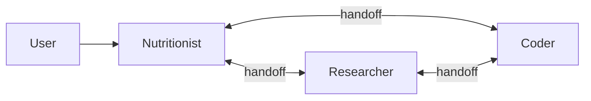

# Ration Agent - Coding Agent Reference

> **Purpose**: Provide AI coding agents with comprehensive project context for effective code navigation and development.

## Project Overview

**Ration Agent** is a LangGraph-based multi-agent system for **dairy and companion animal nutrition formulation**. It provides expert nutritional guidance following **NASEM 2021** (dairy cattle), **NRC 2021** (beef cattle), and **FEDIAF** (pets) standards.

### Tech Stack
| Layer | Technology |
|-------|------------|
| Backend | FastAPI, LangGraph, LangChain, PostgreSQL + pgvector |
| Frontend | Next.js 15, React 19, TypeScript, Tailwind CSS |
| AI | OpenAI/OpenRouter with configurable models per agent role |
| Auth | JWT + Google OAuth + SMS (mainland China) |
| Env Management | `uv` for Python, `npm` for Node.js |

---

## Directory Tree

```
ration-agent/
├── backend/                    # FastAPI + LangGraph backend
│   ├── agents/                 # Agent node definitions
│   │   └── nodes.py            # Creates nutritionist/researcher/coder agents with handoff tools
│   ├── api/                    # FastAPI route handlers
│   │   ├── routes.py           # Main API endpoints (sessions, chat, files)
│   │   └── feedback_routes.py  # User feedback collection
│   ├── auth/                   # Authentication system
│   │   ├── routes.py           # Auth endpoints (login, register, SMS)
│   │   ├── admin_routes.py     # Admin user management
│   │   ├── models.py           # User SQLAlchemy models
│   │   ├── schemas.py          # Pydantic auth schemas
│   │   ├── config.py           # JWT and auth settings
│   │   ├── database.py         # Auth database connection
│   │   └── sms_service.py      # Ihuyi SMS provider integration
│   ├── core/                   # Core agent infrastructure
│   │   └── agent.py            # SharedConnectionManager, AgentRegistry, FormulationState
│   ├── formulation/            # Ration optimization engine
│   │   └── optimizer.py        # scipy.optimize-based feed formulation solver
│   ├── migrations/             # Database schema management
│   │   ├── schema_manager.py   # SchemaManager class for all table creation
│   │   ├── data/               # Seed data (system_feedbases.json)
│   │   └── archive/            # Old migration scripts
│   ├── prompts/                # Agent system prompts (Markdown)
│   │   ├── nutritionist.md     # Base nutritionist prompt
│   │   ├── nutritionist_dairy_cow.md  # Dairy cattle expertise (NASEM model dynamics, no hardcoded values)
│   │   ├── nutritionist_beef_cow.md   # NRC 2021 beef cattle expertise
│   │   ├── nutritionist_cat.md        # FEDIAF feline nutrition
│   │   ├── nutritionist_dog.md        # FEDIAF canine nutrition
│   │   ├── researcher.md       # Web research specialist
│   │   ├── coder.md            # Code execution specialist
│   │   └── title_generation.md # Session title generation
│   ├── services/               # Business logic services
│   │   ├── session_manager.py  # Session lifecycle, feedbase management
│   │   ├── chat_history_service.py # Conversation history retrieval
│   │   └── nasem_service.py    # NASEM 2021 Dairy Model wrapper service
│   ├── utils/                  # Shared utilities
│   │   ├── tools.py            # LangChain tool definitions (session files, web search)
│   │   ├── formulation_tools.py # Ration formulation tools (optimize, export)
│   │   ├── nasem_tools.py      # NASEM dairy requirement/evaluation tools
│   │   ├── excel_tools.py      # Excel/CSV parsing utilities
│   │   ├── message_parser.py   # SSE message stream parsing (formulation group includes NASEM tools)
│   │   ├── model_config.py     # Per-agent model configuration
│   │   ├── prompt_loader.py    # Dynamic prompt template loading
│   │   ├── stop_manager.py     # Stream lifecycle, caching, stop/resume (CRITICAL - see below)
│   │   ├── usda_client.py      # USDA FoodData Central API client
│   │   ├── usda_tools.py       # USDA search/detail tools
│   │   ├── system_feedbases.py # Load system feedbase definitions
│   │   ├── language.py         # Locale detection + centralized translations with t() helper
│   │   └── formulation_exporter.py # Excel export tool (extracted from formulation_tools.py)
│   ├── main.py                 # FastAPI app entrypoint
│   ├── models.py               # SQLAlchemy ORM models (sessions, feedbases, etc.)
│   ├── setup_store.py          # LangGraph checkpointer table setup
│   ├── nasem_dairy/            # NASEM 2021 Dairy Model (numpy 2.x compatible fork)
│   ├── tiktoken_cache/         # Bundled tiktoken encoding files (avoids network downloads)
│   └── pyproject.toml          # Python dependencies (use `uv sync`)
│
├── frontend/                   # Next.js 15 App Router frontend
│   ├── app/                    # Next.js pages and layouts
│   │   ├── page.tsx            # Main landing/chat page
│   │   ├── layout.tsx          # Root layout with providers
│   │   ├── chat/               # Chat session page
│   │   ├── login/              # Login page
│   │   ├── register/           # Registration page
│   │   ├── admin/              # Admin panel
│   │   ├── feedbases/          # Feedbase management page
│   │   └── guide/              # User guide page
│   ├── components/             # React components
│   │   ├── ChatInterface.tsx   # Main chat UI with message streaming
│   │   ├── ConversationSidebar.tsx # Session list and navigation
│   │   ├── MessageBubble.tsx   # Message rendering with artifacts
│   │   ├── TypingIndicator.tsx # Agent thinking/typing animation
│   │   ├── FileUpload.tsx      # File upload with drag-drop
│   │   ├── FeedbaseManager.tsx # Feedbase CRUD interface
│   │   ├── FeedEditor.tsx      # Individual feed ingredient editor
│   │   ├── AnimalTypeSelector.tsx # Animal type selection UI
│   │   ├── HtmlArtifact.tsx    # Sandboxed HTML artifact renderer
│   │   ├── UserGuide.tsx       # Comprehensive user guide component
│   │   ├── auth/               # Auth-related components
│   │   ├── admin/              # Admin panel components
│   │   └── ui/                 # shadcn/ui components (Button, Input, etc.)
│   ├── hooks/                  # Custom React hooks
│   │   ├── useAuth.ts          # Authentication state and actions
│   │   ├── useMessages.ts      # Message state management
│   │   ├── useSSEChat.ts       # Server-sent events chat streaming
│   │   └── useSessionHistory.ts # Session history fetching
│   ├── utils/                  # Frontend utilities
│   │   ├── httpClient.ts       # Axios wrapper with auth
│   │   ├── authHeaders.ts      # JWT header injection
│   │   ├── messageProcessor.ts # Message parsing and formatting
│   │   ├── errorHandler.ts     # Error handling utilities
│   │   ├── artifactParser.ts   # HTML artifact extraction
│   │   └── roleMapping.ts      # Agent role display names
│   ├── contexts/               # React contexts
│   ├── types/                  # TypeScript type definitions
│   └── package.json            # Node.js dependencies
│
├── docker-compose.yml          # Local dev: PostgreSQL + pgvector
├── docker-compose.prod.yml     # Production deployment config
├── README.md                   # User-facing documentation
├── SETUP.md                    # Authentication setup guide
└── AGENTS.md                   # This file (agent reference)
```

---

## Multi-Agent Architecture

The system uses **LangGraph Swarm** with three peer agents that can hand off to each other:



| Agent | Role | Tools |
|-------|------|-------|
| **Nutritionist** | Expert nutrition advisor (default entry point) | Formulation, constraints, export, feedbase management, NASEM tools (dairy cow only) |
| **Researcher** | Knowledge and web research | DuckDuckGo search, web crawling |
| **Coder** | Code execution and data processing | Python REPL, file operations, Excel parsing |

**Animal Types Supported**: `dairy_cow` (NASEM 2021 model), `beef_cow`, `cat`, `dog`

### NASEM Feed Data Architecture (Dairy Cow)

The dairy cow feedbase uses the **full NASEM feed library** with native `Fd_*` column names:

- **Source**: `scripts/extract_nasem_feeds.py` extracts all 284 feeds + 81 nutrient columns from NASEM CSV
- **Output**: `scripts/nasem_feedbase.json` with full NASEM `Fd_*` column format
- **Loading**: `system_feedbases.py` overrides `default_dairy_cow` with NASEM feedbase
- **Service**: `NASEMService.build_feed_library_from_feedbase()` converts dict → DataFrame
- **Nutrient Reference**: `prompts/nutritionist_dairy_cow.md` contains a comprehensive NASEM Nutrient Reference section with all 81 `Fd_*` fields documented (names, units, usage notes)

**Feed data structure**:
```python
{
    "feeds": {
        "corn_silage_typical": {
            "dm_percent": 35.0,
            "nasem_name": "Corn silage, typical",
            "nutrients": {"Fd_CP": 8.0, "Fd_NDF": 45.0, "Fd_ADF": 28.0, ...},
            "category": "Grain Crop Forage",
            "type": "Forage",
            "Fd_Libr": "NRC 2020",
            "UID": "NRC16F1001",
            "Fd_Index": 1,
            "Fd_Locked": 0
        }
    }
}
```

### Feedbase Query (Semantic Search)

The `check_feeds` tool uses **semantic search by default** - free-text queries are embedded and matched semantically:

```python
check_feeds(feedbase, "")                          # Category summary for large, names for small
check_feeds(feedbase, "nutrients")                 # List all nutrient columns
check_feeds(feedbase, "corn silage")               # Semantic search (finds similar feeds)
check_feeds(feedbase, "high protein legume")       # Understands meaning, not just keywords
check_feeds(feedbase, "WHERE category IN [Plant Protein]")  # Category filter
check_feeds(feedbase, "[corn_silage, soybean_meal_48]")  # Exact lookup for specific feeds
```

**Semantic search features:**
- Uses OpenAI `text-embedding-3-small` via configured endpoint
- Env vars: `EMBEDDING_ENDPOINT`, `EMBEDDING_API_KEY`, `EMBEDDING_MODEL`
- Pre-computed embeddings in `scripts/feed_embeddings.json` (generate with `--embeddings` flag)
- Returns feeds ranked by similarity score
- Falls back to regex matching if embeddings unavailable
- Agent should always search in **English** (feed embeddings are in English)

### Custom Feedbase (add_feed)

The `add_feed` tool creates custom feedbases by referencing feeds from the default system feedbase:

```python
add_feed("my_farm", "corn_silage", cost_per_kg=0.15)
add_feed("my_farm", "soybean_meal_48", cost_per_kg=0.45, nutrients={"Fd_CP": 50.0})
```

**Behavior:**
- `name` must exist in `default_{animal_type}` (single source of truth)
- All nutrients are copied from source, preserving NASEM model compatibility
- `cost_per_kg` optional (defaults to 0)
- `nutrients` dict merges/overrides specific values only
- Same call adds or updates existing feed in target feedbase
- **Error handling with semantic search**: If the feed name is not found, returns best matching feed names via semantic search (with similarity scores), enabling the agent to auto-correct without a separate `check_feeds` call

### Formulation Constraints (formulate_ration)

The `formulate_ration` tool uses linear programming with three constraint types:

| Type | Purpose | Required Fields |
|------|---------|-----------------|
| `concentration` | Min/max % of nutrient in final ration (DM basis) | `nutrient`, at least one of `min`/`max` |
| `daily_total` | Target daily intake amount with tolerance | `attribute`, `target`, optional `tolerance_percent` (default 3%) |
| `ratio` | Min/max ratio between two nutrients | `numerator`, `denominator`, at least one of `min`/`max` |

**Critical: `dmi` is a special attribute** for `daily_total` type. When used, it sets the total dry matter intake target and enables `kg_per_day` calculations. **Must be specified first** if other `daily_total` nutrient constraints are used.

**Special attributes for `daily_total` (dairy cow only):**
- `mp`: Metabolizable Protein target in g/day (uses full NASEM model for calculation)
- `me`: Metabolizable Energy target in Mcal/day (uses full NASEM model for calculation)

**Optimization Goals** (`optimization_goal` parameter):
| Goal | Description |
|------|-------------|
| `minimize_cost` | (Default) Find the least-cost ration that satisfies all constraints |
| `feasibility` | Find any ration that satisfies constraints without optimizing for cost |
| `maximize_profit` | Maximize `milk_revenue - feed_cost` using NASEM milk prediction (requires `milk_price_per_kg` in animal_params, default 3.0) |

### Animal Parameters State (set_animal_params)

The `set_animal_params` tool stores animal parameters in session state for reuse across multiple tools:

```python
set_animal_params(body_weight=650, milk_prod=35, dim=90, parity=2, bcs=3.0, milk_price_per_kg=4.0)
```

**Parameters stored:**
- `body_weight`: Animal body weight in kg
- `milk_prod`: Target milk production in kg/day
- `dim`: Days in milk
- `parity`: Number of lactations
- `bcs`: Body condition score (1-5)
- `milk_fat_pct`, `milk_protein_pct`: Milk composition
- `days_pregnant`, `breed`: Additional parameters

**Tools that use stored parameters:**
| Tool | Behavior |
|------|----------|
| `formulate_ration` | Uses stored params if `animal_params` not explicitly provided |
| `predict_dairy_requirements` | All params optional, falls back to stored values |
| `evaluate_diet_with_nasem` | All params optional, falls back to stored values |

> [!TIP]
> Call `set_animal_params` once at the start of a formulation workflow. Subsequent tool calls will automatically use the stored values, reducing redundant parameter input.

> [!WARNING]
> **Nutrient names must exactly match feedbase columns** (use `check_feeds(feedbase, "nutrients")` to list them).
> For dairy cows, nutrients use NASEM `Fd_*` prefixes: `Fd_CP`, `Fd_NDF`, `Fd_Ca`, `Fd_DE_Base`, etc.
> Using incorrect names like `CP` instead of `Fd_CP` returns 0 for all feeds → **infeasible optimization**.

> [!IMPORTANT]
> **Optimizer Tolerance Behavior**: With `minimize_cost`, protein sources are nearly always MORE EXPENSIVE than energy sources. The optimizer will push MP/CP constraints to the **minimum acceptable bound**. Use `tolerance_percent: 0` when you want the requirement to be a floor, not a target with downside flexibility.


## StopManager & Message Caching (Critical)

> [!IMPORTANT]
> This is the most commonly misunderstood part of the codebase. Understanding this is essential for working on streaming, history, or stop/resume features.

### The Problem: LangGraph Checkpointer Persistence Gap

LangGraph's `AsyncPostgresSaver` checkpointer **only persists state when a graph finishes execution**:
- When a subgraph completes (e.g., nutritionist finishes responding)
- When a handoff occurs (e.g., `transfer_to_researcher` causes subgraph termination)

**This creates a critical gap**: If the frontend disconnects mid-stream (network issue, user navigates away, browser refresh), intermediate messages are **NOT yet persisted** to the database. When the frontend reconnects:
- The LangGraph checkpointer has no record of the in-flight messages
- The user loses all streaming content since the last persistence point

### The Solution: StopManager's In-Memory Cache

`utils/stop_manager.py` implements a **producer-consumer cache pattern**:

```
┌─────────────────────────────────────────────────────────────────────┐
│                         StopManager                                  │
├─────────────────────────────────────────────────────────────────────┤
│  Producer Task (_producer)          Cache (active_sessions)          │
│  ┌──────────────────────┐          ┌────────────────────────┐       │
│  │ LangGraph.astream()  │ ──────▶  │ [event1, event2, ...]  │       │
│  │ (background task)    │   cache  │ (in-memory per session)│       │
│  └──────────────────────┘          └──────────┬─────────────┘       │
│                                               │                      │
│                                    ┌──────────▼─────────────┐       │
│                                    │ replay_and_tail_cache  │       │
│                                    │ (yields SSE events)    │       │
│                                    └──────────┬─────────────┘       │
│                                               │                      │
└───────────────────────────────────────────────┼──────────────────────┘
                                                ▼
                                         Frontend (SSE)
```

**Key behaviors:**
1. **Producer runs independently**: Even if frontend disconnects, the producer keeps caching events
2. **Cache survives disconnects**: Frontend can reconnect and get all events since last handoff
3. **Cache prunes on handoff**: When a handoff event occurs, cache is pruned (LangGraph persisted that point)
4. **Natural completion clears cache**: When graph finishes normally, cache is cleared after a delay
5. **Interrupt Persistence**: If a turn ends in an `ask_user` interrupt, the cache is **preserved** rather than cleared. This allows the interactive question box to survive page refreshes and reconnections.
6. **Fresh Turn Clears Stale Cache**: Starting a brand-new turn (`STREAM` or `RESUME`) clears any previous turn's cached events to ensure a clean start.

### The `skip_history` Flag

This flag controls whether cached events are replayed on reconnection:

| Endpoint | `skip_history` | Use Case |
|----------|---------------|----------|
| `/chat/stream` (new message) | `true` | New stream request, frontend will show new events only |
| `/sessions/{id}/history` (SSE mode, resume) | `false` | User stopped then resumed - replay all cached events |
| `/sessions/{id}/history` (SSE mode, session switch) | `true` | User switched sessions - frontend cache lost, but DB has history |

**When to use which:**
- **User stops then resumes** (`skip_history=false`): Frontend still has its local message state, but backend may have more events in cache. Replay cache to sync.
- **User switches session/refreshes** (`skip_history=true`): Frontend lost its state. Load persisted history from DB, then tail only new cache events.

### Code Flow Summary

```python
# New message flow
POST /chat/stream/{session_id}
  └─▶ StopManager.stream_to_frontend()
       ├─▶ _producer() starts (caches events from LangGraph)
       └─▶ replay_and_tail_cache(skip_history=True)  # Only new events

# Resume after stop
GET /sessions/{id}/history?stream=true&skip_cache=false
  └─▶ replay_and_tail_cache(skip_history=False)  # Replay all cache

# Session switch / page refresh
GET /sessions/{id}/history?stream=true&skip_cache=true
  └─▶ Load persisted history from DB
  └─▶ replay_and_tail_cache(skip_history=True)  # Only tail new
```

### Key Classes & Methods

| Component | Purpose |
|-----------|---------|
| `StopManager` (singleton) | Manages all active streams, caches, producer tasks |
| `active_sessions: Dict[str, List]` | Per-session event cache |
| `producer_tasks: Dict[str, Task]` | Background LangGraph stream tasks |
| `stream_tasks: Dict[str, Task]` | Frontend SSE connection tasks |
| `_producer()` | Caches events from `agent.astream_events()` |
| `replay_and_tail_cache()` | Yields cached events as SSE, tails new ones |
| `stop_stream()` | Cancels stream but preserves cache for resume |
| `_cleanup_session()` | Clears cache (called on natural completion) |

## Ask User Tool Flow

The `ask_user` tool allows the agent to pause execution and request information from the user. This uses LangGraph's `interrupt()` mechanism.

### Tool Signature

```python
ask_user(description: Optional[str], questions: List[str]) -> str
```

- **`description`**: Optional context explaining why these questions are being asked. Displayed as header text above the questions.
- **`questions`**: List of individual questions. Each should be a separate item, not combined into one string.

### Architecture

```
Agent calls ask_user(description, questions)
    │
    ▼
LangGraph interrupt() pauses execution
    │
    ▼
StopManager sends 'ask_user' SSE event with description + questions
    │
    ▼
Frontend shows UserInputRequest component (description as header, each question with input field)
    │
    ▼
User submits response → POST /chat/resume/{session_id}
    │
    ▼
LangGraph resumes with Command(resume=user_response)
    │
    ▼
Agent receives response and continues execution
```

### Message Rendering

| Stage | Message Type | Rendering |
|-------|--------------|-----------|
| Tool call (suppressed) | - | Not shown to user |
| Tool result (user response) | `user_input` | Amber collapsible bubble with questions context |

The tool call/result are parsed specially in `message_parser.py`:
- `on_tool_start` for `ask_user`: Stores `{description, questions}` in `pending_ask_user[tool_id]`, returns empty (suppressed)
- `on_tool_end` for `ask_user`: Creates `user_input` message with description and questions from `pending_ask_user`

### Usage Guidelines (in Agent Prompts)

| Situation | Action |
|-----------|--------|
| Missing critical parameters (body weight, milk production, DIM, parity, breed for dairy) | Use `ask_user` |
| Non-critical details (exact age if not parity-related, locale) | Assume and document |
| Confirming approach or asking permission | **Never ask** - just proceed |
| Clarifying ambiguous user requirements | Use `ask_user` |

## Key Files Reference

### Backend Core

| File | Purpose |
|------|---------|
| `core/agent.py` | `SharedConnectionManager` (DB pool), `AgentRegistry` (caches compiled graphs per animal type), `FormulationState`/`FormulationSwarmState` (LangGraph state schemas) |
| `agents/nodes.py` | `create_agent_swarm_for_type()` builds the 3-agent swarm with handoff tools |
| `services/session_manager.py` | `SessionManager` class: session CRUD, feedbase storage (PostgreSQL store), conversation streaming |
| `services/nasem_service.py` | `NASEMService`: NASEM 2021 Dairy Model wrapper. **Key methods**: `build_diet_from_formulation()` (centralized diet extraction), `calculate_values(param_names)` (runs NASEM once, returns dict of requested values), convenience wrappers `calculate_mp()`, `calculate_me()` |
| `api/routes.py` | REST endpoints: `/sessions/*`, `/chat/stream/*`, `/chat/resume/*`, `/files/*` |
| `utils/tools.py` | Agent tools: file listing, reading, web search, artifact creation |
| `utils/ask_user_tool.py` | `ask_user` tool: Uses LangGraph `interrupt()` to pause and request user input. Accepts `description` (context) and `questions` (list of individual items). Frontend shows `UserInputRequest` component; response resumes via `/chat/resume` endpoint |
| `utils/formulation_tools.py` | Core formulation tools: `add_feed`, `formulate_ration`, `check_feeds`, `list_feed_bases`, `set_animal_params`. **Critical**: `formulate_ration` checks if state `animal_params` is non-empty (has `milk_prod`) before using, since state defaults to `{}`. Returns clear error if MP/ME constraints used without animal_params. Export tool imported from `formulation_exporter.py` |
| `utils/formulation_exporter.py` | `export_formulation` tool (~900 lines): Creates unified Summary tab with 3 sections. Uses stored `animal_params` from state for NASEM evaluation (no need to re-input). Uses `NASEMService.build_diet_from_formulation()` for consistency. Also creates NASEM category tabs for dairy |
| `utils/language.py` | Centralized i18n: `normalize_locale()`, `t(key, locale)` helper for type-safe translations, `get_export_texts(locale)` for Excel export strings. ~160 translation keys for zh-CN/en-US. Uses `[INSTRUCTION: ...]` blocks in some tool result messages to guide agent response behavior (e.g., export success instructs agent to be brief) |
| `utils/nasem_tools.py` | `predict_dairy_requirements`, `evaluate_diet_with_nasem` tools for dairy cow nutritionist. Uses NASEM equations for factorial requirements (eq 8) and diet evaluation. `formulate_ration` now supports `animal_params` for embedded DMI prediction (eq 9). **Critical**: Uses `NASEMService.build_diet_from_formulation()` for consistent diet conversion. Emits `yield_constraint_warnings` when MP-allowable, NE-allowable, or predicted milk are >5% below target |
| `utils/prompt_loader.py` | Loads agent prompts with Jinja2 templating. Implements **Anthropic prompt caching** via OpenRouter: system prompt + conversation history messages get `cache_control: ephemeral` for ~87% cost reduction on multi-tool-call chains |
| `utils/system_feedbases.py` | Loads system feedbase definitions. For dairy cow, uses NASEM feedbase JSON with full `Fd_*` nutrient columns extracted from NASEM feed library |
| `formulation/optimizer.py` | `FormulationOptimizer`: scipy SLSQP-based formulation solver. Uses full NASEM model for MP/ME/milk constraints via `_get_nasem_values()`. **Per-iteration caching**: All NASEM params fetched in single call and cached by exact `x` value. Cache cleared at start of each `optimize()` call. Reduces ~5 NASEM calls to 1 per iteration (4.6× speedup, 81% cache hit rate). `NASEMCacheStats` tracks hits/misses |

### Frontend Core

| File | Purpose |
|------|---------|
| `app/page.tsx` | Landing page with session creation flow |
| `components/ChatInterface.tsx` | Main chat container with SSE streaming. Implements **smart auto-scroll**: only scrolls to bottom when user is already at or near the bottom, allowing users to scroll up to read previous messages without interruption |
| `components/TypingIndicator.tsx` | Agent thinking/typing animation. Thinking, analysis, and formulation states now persist when stopped (marked as complete rather than cleared), showing a static summary of interrupted work |
| `hooks/useSSEChat.ts` | EventSource connection, message parsing, stop handling |
| `hooks/useMessages.ts` | Message state, optimistic updates, history loading, `resumeChat()` for ask_user response. `AskUserState` includes `description?: string \| null` for context |
| `components/MessageBubble.tsx` | Message rendering: markdown, artifacts, tool calls. Includes `user_input` type with collapsible amber bubble showing questions context and response preview |
| `components/UserInputRequest.tsx` | Amber-themed card for `ask_user` tool: displays `description` as context text above questions, per-question input fields, combines answers as \"Q1: answer1\\nQ2: answer2\" format. Collapsed header shows truncated description. Uses a responsive grid layout (`sm:grid-cols-[1fr_220px]`) for alignment. |

---

## Development Commands

### Backend
```bash
cd backend
uv sync                          # Install dependencies
uv run python main.py            # Start API server (localhost:8000)
uv run python basic_test.py      # Run basic agent tests
uv run python test_optimizer.py  # Test formulation optimizer
uv run python formulate_cli.py   # CLI ration formulation tool (--help for options)
```

### Frontend
```bash
cd frontend
npm install                      # Install dependencies
npm run dev                      # Start dev server (localhost:3000)
npm run build                    # Production build
npm run lint                     # ESLint check
```

### Database
```bash
docker-compose up -d postgres    # Start PostgreSQL with pgvector
docker-compose logs postgres     # View logs
```

---

## Coding Conventions

### Python (Backend)
- **Style**: PEP 8, 4-space indent, `snake_case` functions, `PascalCase` classes
- **Type Hints**: Required for public APIs
- **Docstrings**: Required for tools and prompts
- **Imports**: Standard library → Third-party → Local

### TypeScript (Frontend)
- **Components**: Functional with hooks, `PascalCase` filenames
- **Hooks**: `camelCase`, prefix with `use`
- **Styling**: Tailwind utility classes in JSX
- **Types**: Defined in `types/` directory

### Prompts
- Location: `backend/prompts/`
- Naming: `role.md` or `role_animal.md`
- Format: Markdown with structured sections

---

## Environment Variables

### Backend (`backend/.env`)
```env
# Database
POSTGRES_HOST=localhost
POSTGRES_PORT=5433
POSTGRES_DB=ration_agent
POSTGRES_USER=ration_user
POSTGRES_PASSWORD=ration_password

# AI Models
OPENROUTER_API_KEY=your_key
OPENAI_ENDPOINT=https://openrouter.ai/api/v1
OPENROUTER_MODEL=anthropic/claude-3.5-sonnet

# Auth
JWT_SECRET=your_secret_32_chars_min
GOOGLE_OAUTH_CLIENT_ID=optional

# SMS (optional, China only)
IHUYI_SMS_ACCOUNT=api_id
IHUYI_SMS_PASSWORD=api_key
```

### Frontend (`frontend/.env`)
```env
NEXT_PUBLIC_GOOGLE_CLIENT_ID=same_as_backend_if_using_google
```

### DeepSeek Direct API Configuration
When using DeepSeek API directly (not via OpenRouter):

```env
# DeepSeek API Direct
OPENAI_ENDPOINT=https://api.deepseek.com/v1
OPENROUTER_API_KEY=sk-your-deepseek-api-key

# Model options:
# - deepseek-chat: Standard model, supports tool calling
# - deepseek-reasoner: Thinking mode model (CoT reasoning)
NUTRITIONIST_MODEL=deepseek-reasoner
RESEARCHER_MODEL=deepseek-reasoner
CODER_MODEL=deepseek-reasoner
TITLE_GENERATION_MODEL=deepseek-chat

# For deepseek-chat with thinking mode (V3.2):
# DEEPSEEK_THINKING_MODE=true
```

**DeepSeek Compatibility Notes:**
- `utils/deepseek_wrapper.py`: Monkey-patches langchain-openai to handle `reasoning_content` for thinking mode tool calls
- `utils/prompt_loader.py`: Anthropic cache_control is only applied for Claude models
- `utils/model_config.py`: max_tokens capped at 8192 (DeepSeek limit)
- **Reasoning Content Rendering**: When using `deepseek-reasoner`, the model's `reasoning_content` is streamed to the frontend as a separate `thinking` message type, displayed in a collapsible purple indicator block that auto-scrolls and collapses when the final answer starts

---

## Testing

- **Backend tests**: `test_*.py` files in `backend/`
- **Run with**: `uv run python <test_file>.py`
- **Key test files**:
  - `basic_test.py` - Agent workflow tests
  - `test_optimizer.py` - Formulation engine tests
  - `test_calculator.py` - Feed calculation tests

---

## Common Tasks

### Adding a New Tool
1. Define in `utils/tools.py` or `utils/formulation_tools.py`
2. Add to appropriate `get_*_tools()` function
3. Update agent prompt in `prompts/` if needed
4. Follow docstring guidelines below

### Tool Docstring Guidelines

Tool docstrings must be **neutral and descriptive**. The agent should decide when/how to use tools based on its prompt and reasoning, not embedded instructions in docstrings.

**✅ Include:**
| Category | Example |
|----------|---------|
| What the tool does | "Create an HTML artifact displayed in the frontend" |
| What it produces/returns | "Creates interactive HTML content, charts, visualizations" |
| Parameter descriptions | "body_weight: Animal body weight in kg" |
| Technical behavior/preconditions | "Requires a successful formulation in state" |
| Format requirements | "Expression formats: single, multi-line, variables" |

**❌ Avoid:**
| Category | Bad Example | Why |
|----------|-------------|-----|
| Usage incentives | "Use this tool when you want to..." | Tells agent when to use |
| Workflow instructions | "Use this BEFORE formulation, then use X for validation" | Prescribes workflow |
| Behavior directives | "(REQUIRED - ask user if not provided)" | Instructs agent behavior |
| Emphasis markers | "IMPORTANT:", "CRITICAL:", "You MUST..." | Biases agent decisions |
| Auto-loading notes | "AUTOMATICALLY loaded from state" | Emphasis, not description |

**Neutral reframing examples:**
```python
# ❌ Bad: "Use this to get requirements BEFORE formulation"
# ✅ Good: "Calculates factorial requirements from animal parameters (no diet needed)"

# ❌ Bad: "body_weight: Animal body weight in kg (REQUIRED - ask user if not provided)"
# ✅ Good: "body_weight: Animal body weight in kg"

# ❌ Bad: "IMPORTANT: If set_animal_params was called, those parameters are AUTOMATICALLY USED"
# ✅ Good: "If not provided, uses parameters from session state (set via set_animal_params)"
```

### Adding a New Animal Type
1. Create `prompts/nutritionist_<animal>.md`
2. Update `agents/nodes.py` agent list
3. Add to frontend `AnimalTypeSelector.tsx`

### Modifying Database Schema
1. Update `models.py` with new columns/tables
2. Add migration to `migrations/schema_manager.py`
3. Test with fresh database

---

## Secrets & Security

- **Never commit**: `.env` files, API keys, credentials
- **Session isolation**: Users only access their own sessions
- **File safety**: Duplicate sample data to session directories, never edit shared files
